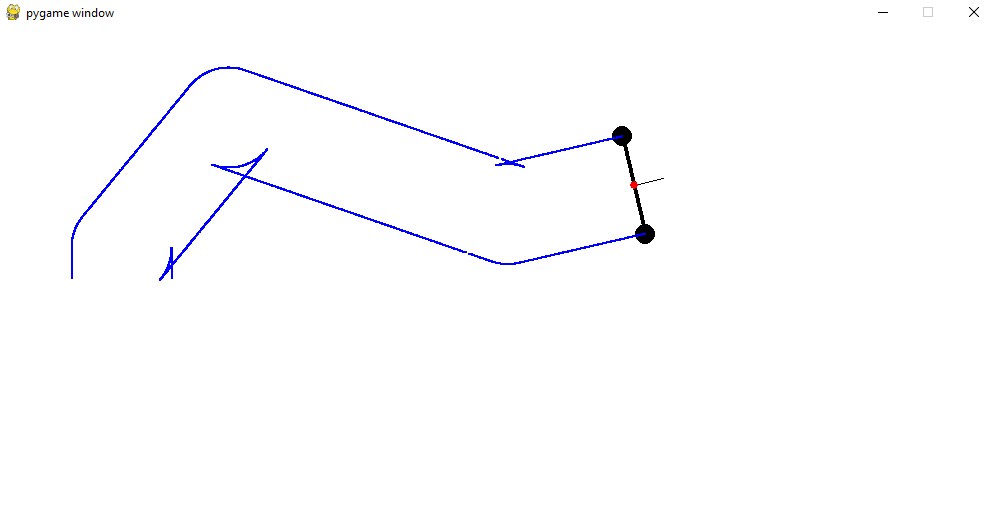
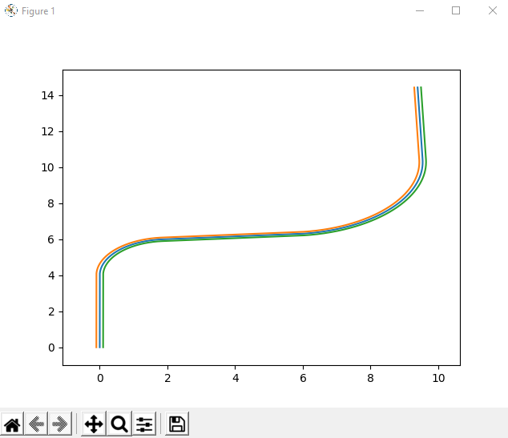
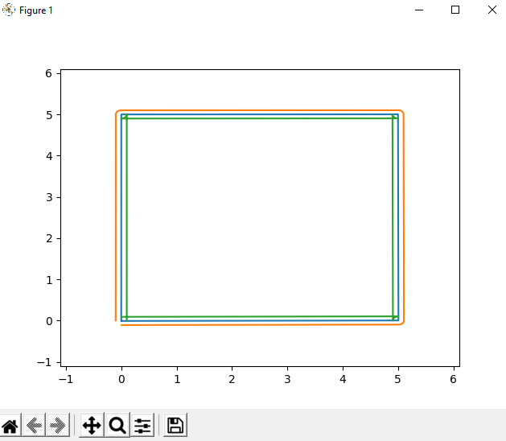

# Robot Animation
School assignment. Simulating 2 wheels robot in different modes.

This project contains of 2 programs. 

- First is game, you can run it by:

                                python robot_game.py
    It looks like this, you can manipulate the robot by AWSD and it is drawing trajectory of it's wheels:
    

- Second is console application, you can run it by:

                                python robot_game.py [mode]
  - mode [-t] 
      You enter two radius and linear line length and it will draw a trajectory of robot with these parameters
        
  - mode [-c] 
      You enter length of side of cube and it will draw a trajectory of this cube.
      

